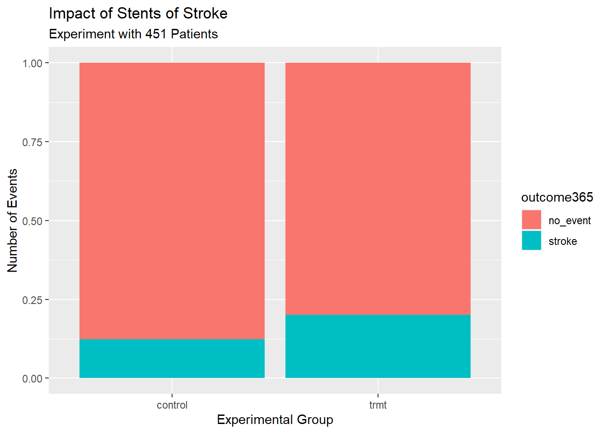

# (PART) Descriptive Statistical Modeling {-} 

# Case Study {#CS1}

## Objectives

1) Use R for basic analysis and visualization.  
2) Compile a report using `knitr`.


## Homework    

Load `tidyverse`,`mosaic`, and `knitr` packages.  


```r
library(tidyverse)
library(mosaic)
library(knitr)
```

### Problem 1  

**Stent study continued** Complete a similar analysis for the stent data but this time for the one year data. In particular

  a. Read the data into your working directory.
  

```r
stent_study <-read_csv('data/stent_study.csv')
```
  


  b. Complete similar steps as in the class notes.  
    i. Use `inspect` on the data.  
    ii. Create a table of `outcome365` and `group`. Comment on the results.  
    iii. Create a barchart of the data.  

Using `inspect`  


```r
inspect(stent_study)
```

```
## 
## categorical variables:  
##         name     class levels   n missing
## 1      group character      2 451       0
## 2  outcome30 character      2 451       0
## 3 outcome365 character      2 451       0
##                                    distribution
## 1 control (50.3%), trmt (49.7%)                
## 2 no_event (89.8%), stroke (10.2%)             
## 3 no_event (83.8%), stroke (16.2%)
```

The table: 


```r
tally(outcome365~group,data=stent_study,format="proportion",margins = TRUE)
```

```
##           group
## outcome365   control      trmt
##   no_event 0.8766520 0.7991071
##   stroke   0.1233480 0.2008929
##   Total    1.0000000 1.0000000
```

Patients in the treatment group had a higher proportion of strokes than those in the control group after one year. The treatment does not appear to help the rate of strokes and in fact may hurt it.

Barchart: 


```r
stent_study %>%
  gf_props(~group,fill=~outcome365,position='fill') %>%
  gf_labs(title="Impact of Stents of Stroke",
  subtitle='Experiment with 451 Patients',
  x="Experimental Group",
  y="Number of Events")
```



### Problem 2 

**Migraine and acupuncture**  A migraine is a particularly painful type of headache, which patients sometimes wish to treat with acupuncture. To determine whether acupuncture relieves migraine pain, researchers conducted a randomized controlled study where 89 females diagnosed with migraine headaches were randomly assigned to one of two groups: treatment or control. 43 patients in the treatment group received acupuncture that is specifically designed to treat migraines. 46 patients in the control group received placebo acupuncture (needle insertion at nonacupoint locations). 24 hours after patients received acupuncture, they were asked if they were pain free.^[G. Allais et al. [“Ear acupuncture in the treatment of migraine attacks:  a randomized trial on the efficacy of appropriate versus inappropriate acupoints”.](http://www.ncbi.nlm.nih.gov/pubmed/21533739) In: Neurological Sci. 32.1 (2011), pp. 173–175.]


The data is in the file `migraine_study.csv` in the folder `data`.

Complete the following work:

  a. Read the data into an object called `migraine_study`.  
  

```r
migraine_study <- read_csv("data/migraine_study.csv")
```
  

```r
head(migraine_study)
```

```
## # A tibble: 6 × 2
##   group     pain_free
##   <chr>     <chr>    
## 1 treatment yes      
## 2 treatment yes      
## 3 treatment yes      
## 4 treatment yes      
## 5 treatment yes      
## 6 treatment yes
```
  

  b. Create a table of the data.
  

```r
tally(pain_free~group,data=migraine_study,format="proportion",margin=TRUE)
```

```
##          group
## pain_free    control  treatment
##     no    0.95652174 0.76744186
##     yes   0.04347826 0.23255814
##     Total 1.00000000 1.00000000
```
   
  
  c. Report the percent of patients in the treatment group who were pain free 24 hours after receiving acupuncture.
  
  There are 23.2% of the treatment group pain free.
  
  d. Repeat for the control group.
  
  There are only 4.3% of the control group pain free.
  
  e. At first glance, does acupuncture appear to be an effective treatment for migraines? Explain your reasoning.
  
  Yes, a substantial increase in the percentage of patients pain free after acupuncture versus those with no acupuncture, so it appears to be effective.
  
  f. Do the data provide convincing evidence that there is a real pain reduction for those patients in the treatment group? Or do you think that the observed difference might just be due to chance?
  
  Either of these is acceptable:  
  
 i. We could get slightly different group estimates even if there is no real difference. Though the difference is big, I'm skeptical the results show a real difference and think this might be due to chance.  
 ii. The difference in these rates looks pretty big, and so I suspect acupuncture is having a positive impact on pain.


3. Compile, `knit`, this report into a pdf.

Complete on your computer or server.

