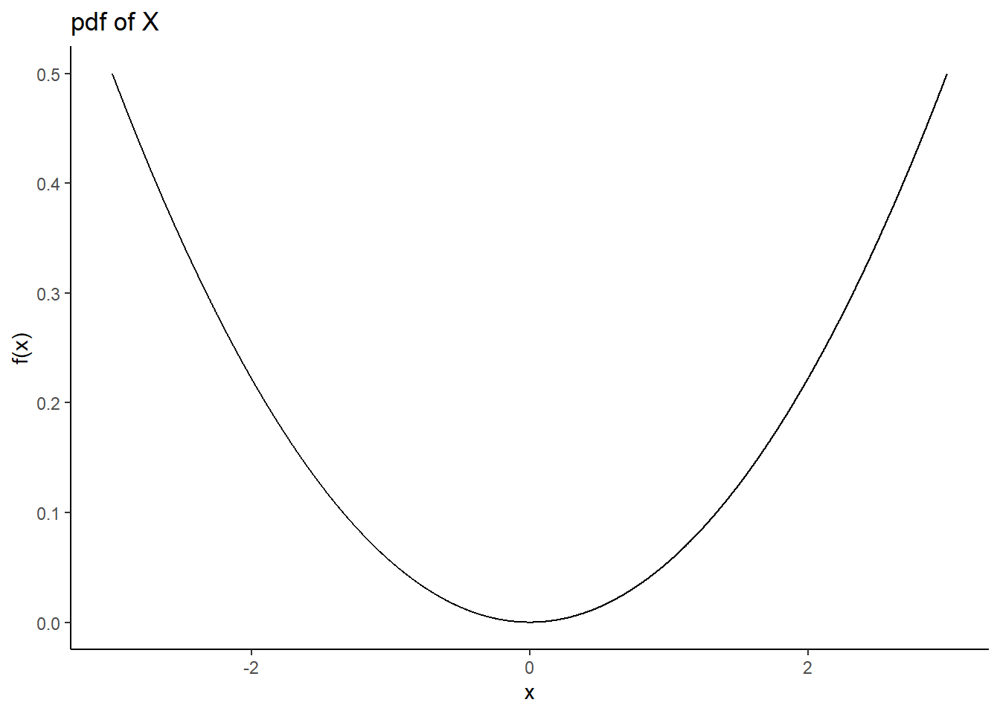
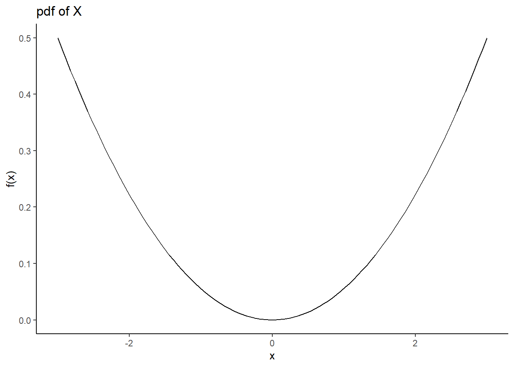
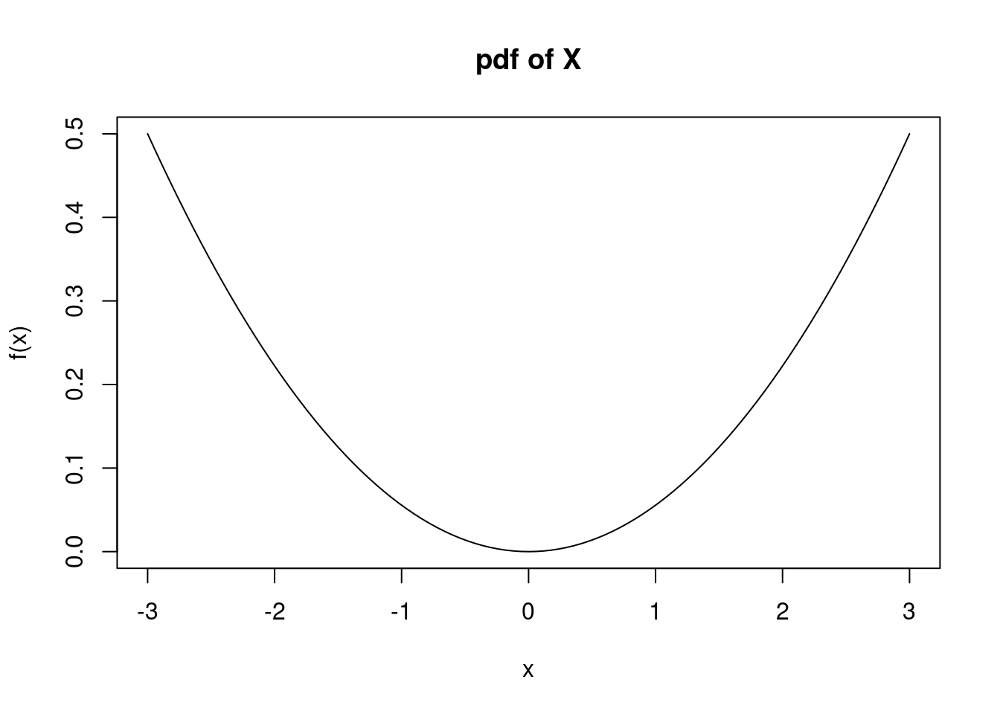
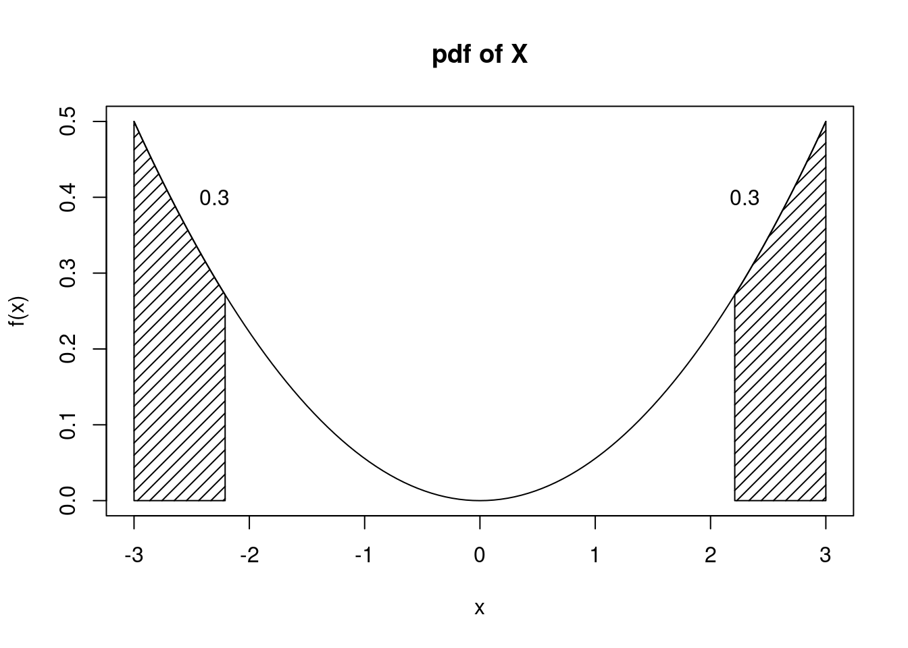
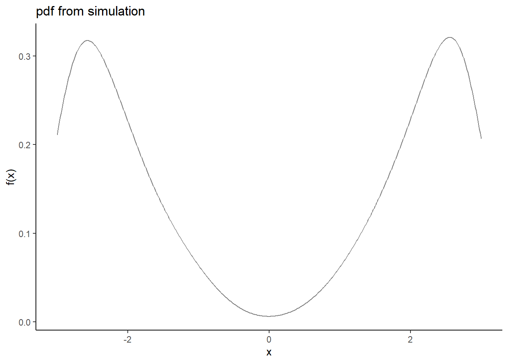

# Continuous Random Variables {#CONRANDVAR}

## Objectives

1) Define and properly use the new terms to include probability density function (pdf) and cumulative distribution function (cdf) for continuous random variables.  
2) Given a continuous random variable, find probabilities using the pdf and/or the cdf.  
3) Find the mean and variance of a continuous random variable. 


## Homework  

### Problem 1  

Let $X$ be a continuous random variable on the domain $-k \leq X \leq k$. Also, let $f(x)=\frac{x^2}{18}$. 

a. Assume that $f(x)$ is a valid pdf. Find the value of $k$. 

Because $f$ is a valid pdf, we know that $\int_{-k}^k \frac{x^2}{18}\diff x = 1$. So, 
$$
\int_{-k}^k \frac{x^2}{18}\diff x = \frac{x^3}{54}\bigg|_{-k}^k = \frac{k^3}{54}-\frac{-k^3}{54}=\frac{k^3}{27}=1
$$

Thus, $k=3$. 

Using `R`, see if you can follow the code.


```r
my_pdf <- function(x)integrate(function(y)y^2/18,-x,x)$value
```


```r
my_pdf<-Vectorize(my_pdf)
```


```r
domain <- seq(.01,5,.1)
gf_line(my_pdf(domain)~domain) %>%
  gf_theme(theme_classic()) %>%
  gf_labs(title="Cumulative probability for different values of k",x="k",y="Cummulative Probability") %>%
  gf_hline(yintercept = 1,color = "blue")
```


Looks like $k \approx 3$ from the plot.


```r
uniroot(function(x)my_pdf(x)-1,c(-10,10))$root
```

```
## [1] 2.999997
```


b. Plot the pdf of $X$. 


```r
x<-seq(-3,3,0.001)
fx<-x^2/18
gf_line(fx~x,ylab="f(x)",title="pdf of X") %>%
  gf_theme(theme_classic())
```




```r
ggplot(data.frame(x=c(-3, 3)), aes(x)) + 
 stat_function(fun=function(x) x^2/18) +
  theme_classic() +
  labs(y="f(x)",title="pdf of X")
```




```r
curve(x^2/18,from=-3,to=3,ylab="f(x)",main="pdf of X")
```



c. Find and plot the cdf of $X$.
$$
F_X(x)=\Prob(X\leq x)=\int_{-3}^x \frac{t^2}{18}\diff t = \frac{t^3}{54}\bigg|_{-3}^x = \frac{x^3}{54}+\frac{1}{2}
$$

$$
F_X(x)=\left\{\begin{array}{ll} 0, & x<-3 \\ \frac{x^3}{54}+\frac{1}{2}, & -3\leq x \leq 3 \\ 1, & x>3 \end{array}\right.
$$


```r
x<-seq(-3.5,3.5,0.001)
fx<-pmin(1,(1*(x>=-3)*(x^3/54+1/2)))
gf_line(fx~x,ylab="F(x)",title="cdf of X") %>%
  gf_theme(theme_classic())
```


d. Find $\Prob(X<1)$. 
$$
\Prob(X<1)=F(1)=\frac{1}{54}+\frac{1}{2}=0.519
$$


```r
integrate(function(x)x^2/18,-3,1)
```

```
## 0.5185185 with absolute error < 5.8e-15
```


e. Find $\Prob(1.5<X\leq 2.5)$.
$$
\Prob(1.5< X \leq 2.5)=F(2.5)-F(1.5)=\frac{2.5^3}{54}+\frac{1}{2}-\frac{1.5^3}{54}-\frac{1}{2}=0.227
$$


```r
integrate(function(x)x^2/18,1.5,2.5)
```

```
## 0.2268519 with absolute error < 2.5e-15
```


f. Find the 80th percentile of $X$ (the value $x$ for which 80% of the distribution is to the left of that value). 

Need $x$ such that $F(x)=0.8$. Solving $\frac{x^3}{54}+\frac{1}{2}=0.8$ for $x$ yields $x=2.530$. 


```r
uniroot(function(x)x^3/54+.5-.8,c(-3,3))
```

```
## $root
## [1] 2.530293
## 
## $f.root
## [1] -1.854422e-06
## 
## $iter
## [1] 6
## 
## $init.it
## [1] NA
## 
## $estim.prec
## [1] 6.103516e-05
```


g. Find the value $x$ such that $\Prob(-x \leq X \leq x)=0.4$. 

Because this distribution is symmetric, finding $x$ is equivalent to finding $x$ such that $\Prob(X>x)=0.3$. (It helps to draw a picture). Thus, we need $x$ such that $F(x)=0.7$. Solving $\frac{x^3}{54}+\frac{1}{2}=0.7$ for $x$ yields $x=2.210$.



h. Find the mean and variance of $X$. 
$$
\E(X)=\int_{-3}^3 x\cdot\frac{x^2}{18}\diff x = \frac{x^4}{72}\bigg|_{-3}^3=\frac{81}{72}-\frac{81}{72} = 0
$$

$$
\E(X^2)=\int_{-3}^3 x^2\cdot\frac{x^2}{18}\diff x = \frac{x^5}{90}\bigg|_{-3}^3=\frac{243}{90}-\frac{-243}{90} = 5.4
$$

$$
\Var(X)=\E(X^2)-\E(X)^2=5.4-0^2=5.4
$$

i. Simulate 10000 values from this distribution and plot the density.

This is tricky since we need a cube root function. Just raising to the one-third power won't work. Let's write our own function.


```r
cuberoot <- function(x) {
  sign(x) * abs(x)^(1/3)}
```


```r
set.seed(4)
results <- do(10000)*cuberoot((runif(1)-.5)*54)
```


```r
results %>%
  gf_dens(~cuberoot) %>%
  gf_theme(theme_classic()) %>%
  gf_labs(title="pdf from simulation",x="x",y="f(x)") 
```



Notice that the smoothing operation goes past the support of $X$ and thus shows a concave down curve. We could clean up by limiting the x-axis to the interval [-3,3].


```r
inspect(results)
```

```
## 
## quantitative variables:  
##          name   class       min        Q1     median       Q3      max
## ...1 cuberoot numeric -2.999981 -2.382864 -0.1574198 2.376346 2.999347
##              mean       sd     n missing
## ...1 -0.002416475 2.322639 10000       0
```


\newpage

### Problem 2

Let $X$ be a continuous random variable. Prove that the cdf of $X$, $F_X(x)$ is a non-decreasing function. (Hint: show that for any $a < b$, $F_X(a) \leq F_X(b)$.)

Let $a<b$, where $a$ and $b$ are both in the domain of $X$. Note that $F_X(a)=\Prob(X\leq a)$ and $F_X(b)=\Prob(X\leq b)$. Since $a<b$, we can partition $\Prob(X\leq b)$ as $\Prob(X\leq a)+\Prob(a < X \leq b)$. One of the axioms of probability is that a probability must be non-negative, so I know that $\Prob(a < X \leq b)\geq 0$. Thus, 
$$
\Prob(X\leq b)=\Prob(X\leq a)+\Prob(a < X \leq b) \geq \Prob(X\leq a)
$$

So, we have shown that $F_X(a)\leq F_X(b)$. Thus, $F_X(x)$ is a non-decreasing function. 

