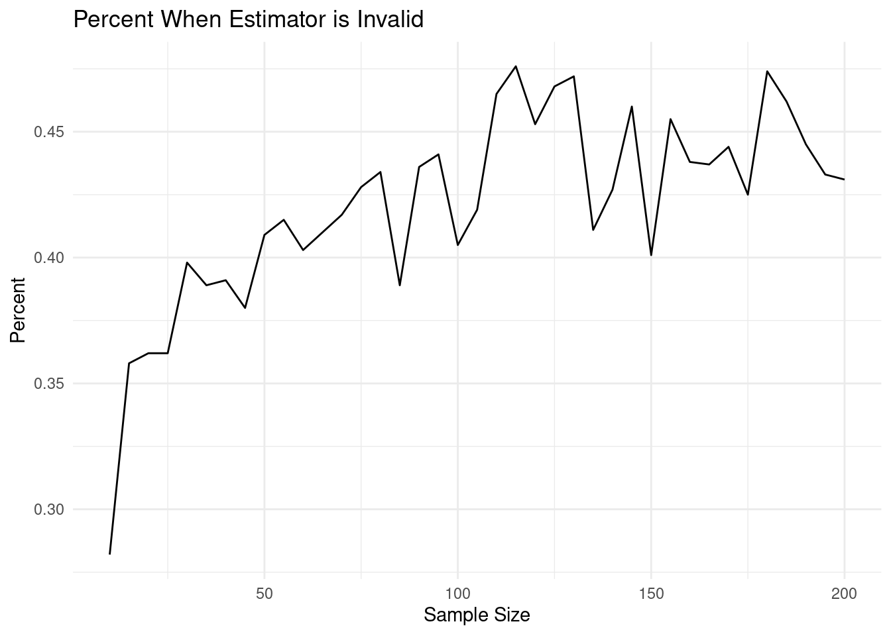
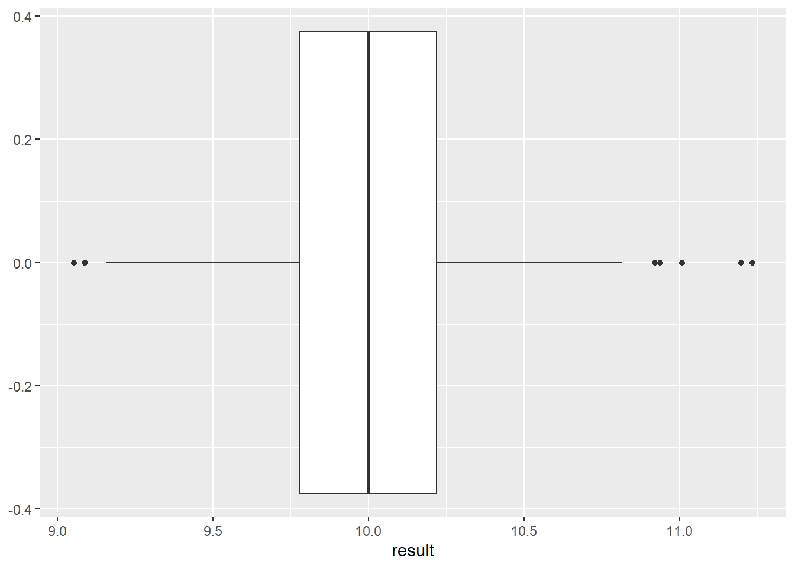

# Estimation Methods {#EST}


## Objectives

1) Obtain a method of moments estimate of a parameter or set of parameters.    
2) Given a random sample from a distribution, obtain the likelihood function.   
3) Obtain a maximum likelihood estimate of a parameter or set of parameters.  
4) Determine if an estimator is unbiased. 

## Homework  

### Problem 1 

In the chapter notes, we found that if we take a sample from the uniform distribution $\textsf{Unif}(0,\theta)$, the method of moments estimate of $\theta$ is $\hat{\theta}_{MoM}=2\bar{x}$. Suppose our sample consists of the following values: 
$$
0.2 \hspace{0.4cm} 0.9 \hspace{0.4cm} 1.9 \hspace{0.4cm} 2.2 \hspace{0.4cm} 4.7 \hspace{0.4cm} 5.1
$$

a) What is $\hat{\theta}_{MoM}$ for this sample? 


```r
x<-c(0.2,0.9,1.9,2.2,4.7,5.1)
thetamom<-2*mean(x)
thetamom
```

```
## [1] 5
```

b) What is wrong with this estimate? 

For our distribution $\theta$ is the upper bound or largest value for the random variable. The estimate for $\theta$ is 5, which is an impossible value for $\theta$, since one of our observations (5.1) is beyond this value. 

c) Show that this estimator is unbiased.

We need to show that 
$$
E\left( \hat{\theta}_{MoM} \right) = \theta
$$
We proceed as follows
$$
E \left(2\bar{X} \right) = 2 E\left( \sum{\frac{X_i}{n}} \right) = \frac{2}{n} E\left( \sum{X_i} \right)
$$
$$
=\frac{2}{n}  \sum{E\left(X_i \right)} =\frac{2}{n}\sum{\frac{\theta}{2}}=\frac{n\theta}{n}=\theta
$$
Notice that in performing this derivation, we treated $X$ as a random variable and not as $x$, a data value.

\pagebreak

d) ADVANCED: Use simulation in `R` to find out how often the method of moment estimator is less the maximum observed value, ($\hat{\theta}_{MoM} < \max x$). Report an answer for various sizes of samples. You can just pick an arbitrary value for $\theta$ when you sample from the uniform. However, the minimum must be 0.


Let's start by writing code for one sample size and then generalize. This function will take as input the number of data points, sample that many points from a uniform with a max of 5, and then return a logical value comparing the method of moments estimate to the observed maximum. The choice of a maximum value for the uniform distribution is arbitrary.


```r
check <- function(n=10){
  temp<-runif(n,max=5)
  2*mean(temp)<max(temp)
}
```

Let's test the function.


```r
set.seed(3030)
temp<-runif(10,max=5)
temp
```

```
##  [1] 1.048619 2.370056 0.675677 2.434443 2.994015 3.930865 4.708367 1.645806
##  [9] 2.592365 3.664424
```

```r
2*mean(temp)
```

```
## [1] 5.212927
```

Reset the seed and run the function, we should get FALSE.


```r
set.seed(3030)
check(10)
```

```
## [1] FALSE
```

Now let's repeat the test 10000 find the proportion of times the method of moments estimator is unrealistic.


```r
(do(10000)*check(10)) %>%
  summarize(mean(check)) %>%
  pull()
```

```
## [1] 0.285
```

Let's make `check` a vectorized function for we can run for many sample sizes.


```r
check <- Vectorize(check)
```

Run 1000 replicates for each sample size. The rest of the code gets my data frame in the proper shape.


```r
my_data<-(do(1000)*check(seq(10,200,5))) %>%
  summarise_all(mean) %>%
  pivot_longer(everything(),names_to = "Sample",values_to = "Percent") %>%
  mutate(Sample=seq(10,200,5))
```

A quick look at the data.


```r
head(my_data)
```

```
## # A tibble: 6 x 2
##   Sample Percent
##    <dbl>   <dbl>
## 1     10   0.282
## 2     15   0.358
## 3     20   0.362
## 4     25   0.362
## 5     30   0.398
## 6     35   0.389
```

Now we can plot the results of sample size versus


```r
my_data %>%
  gf_line(Percent~Sample,xlab="Sample Size",title="Percent When Estimator is Invalid") %>%
  gf_theme(theme = theme_minimal())
```



Here is more traditional, old school `R` code.


```r
simn<-function(n){
  y<-replicate(1000,{
    x<-runif(n)
    (2*mean(x))<max(x)
  })
  mean(y)
}

t<-seq(10,200,4)
persim<-sapply(t,simn)
plot(t,persim,type="l")
```


### Problem 2

Let $x_1,x_2,...,x_n$ be a simple random sample from an exponentially distributed population with parameter $\lambda$. Find $\hat{\lambda}_{MoM}$. 

Recall that $\E(X)={1\over \lambda}$. Setting this equal to the sample moment $\bar{x}$ and solving for $\lambda$ yields the method of moment estimator. Thus,
$$
\hat{\lambda}_{MoM}={1\over \bar{x}}
$$

### Problem 3

Let $x_1,x_2,...,x_n$ be an iid random sample from an exponentially distributed population with parameter $\lambda$. Find $\hat{\lambda}_{MLE}$.

Recall that 
$$
f_X(x;\lambda)=\lambda e^{-\lambda x}
$$

So the likelihood function is: 
$$
L(\lambda;\boldsymbol{x})=\prod_{i=1}^n \lambda e^{-\lambda x_i}=\lambda^n e^{-\lambda\sum x_i}
$$

And the log-likelihood function is:
$$
l(\lambda;\boldsymbol{x})=n\log \lambda - \lambda \sum x_i
$$

Taking the derivative with respect to $\lambda$ and setting equal to 0:
$$
{\diff l(\lambda;\boldsymbol{x})\over \diff \lambda}={n\over \lambda}-\sum x_i =0
$$

Note that ${\diff^2 l(\lambda;\boldsymbol{x})\over\diff \lambda^2}=-{n\over \lambda^2}<0$, so $l$ is always concave down. Thus, any optimum found is a maximum. 

So, 
$$
\hat{\lambda}_{MLE}={n\over \sum x_i}={1\over \bar{x}}
$$

### Problem 4  

It is mathematically difficult to determine if the estimators found in questions 2 and 3 are unbiased. Since the sample mean is in the denominator; mathematically we may have to work with the joint pdf. So instead, use simulation to get an sense of whether the method of moments estimator for the exponential distribution is unbaised.

We need to sample data from an exponential and then compare the the reciprocal of the mean to the parameter.


```r
set.seed(630)
1/mean(rexp(1000,rate=10))
```

```
## [1] 10.09422
```

This is close, maybe we just got lucky. Let's repeat many times.


```r
(do(1000)*(1/mean(rexp(1000,rate=10)))) %>%
  gf_boxplot(~result)
```



Looks like it has the potential to be unbiased. We would need to investigate other values for $\lambda$.

### Problem 5  

Find a maximum likelihood estimator for $\theta$ when $X\sim\textsf{Unif}(0,\theta)$. Compare this to the method of moments estimator we found. Hint: Do not take the derivative of the likelihood function. 

$$
L(\theta;\boldsymbol{x})=\frac{1}{\theta^n}, \hspace{0.5cm} \mbox{only if all }x_i\leq \theta
$$

A better way to write this is so as to see the answer is to let $M =max(x_i)$, then:

$$
L(\theta;\boldsymbol{x})=\left\{\begin{array}{ll} 0, & \theta < M= max(x_i) \\
\frac{1}{\theta^n}, & \theta \geq M = max(x_i) \\
\end{array}\right. 
$$
Figure \@ref(fig:fig1) is a plot of this likelihood function and you can see that the maximum occurs at the maximum observed data point. 

<div class="figure" style="text-align: center">

<p class="caption">(\#fig:fig1)A graph of the likelihood function</p>
</div>

Recall that $f(x_i;\theta)={1\over \theta}$ if $x_i\in [0,\theta]$ and 0 elsewhere. And since the likelihood function is simply the product of these pdfs, if any $x_i$ is beyond $\theta$, then the entire likelihood function is 0. 

You can picture $L$ as a decreasing function of $\theta$, but remembering that $L$ takes the value 0 if $\theta$ is smaller than at least one $x_i$. Thus, $L$ achieves its maximum at $\theta=\max x_i$. 

This estimate is more intuitive than the method of moments estimate ($2\bar{x}$). The method of moments estimate is sometimes not feasible. Meanwhile, the MLE ($\max x_i$) is always feasible. 

