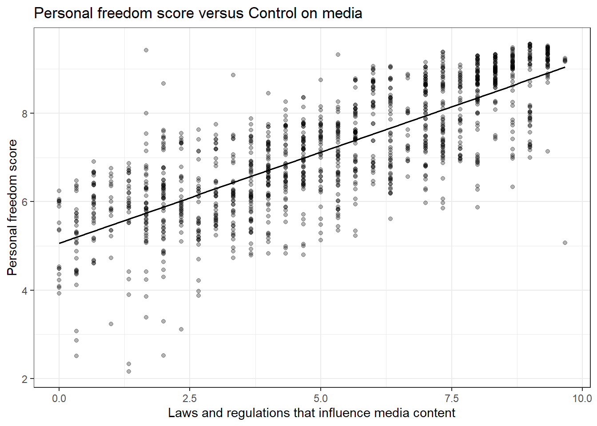
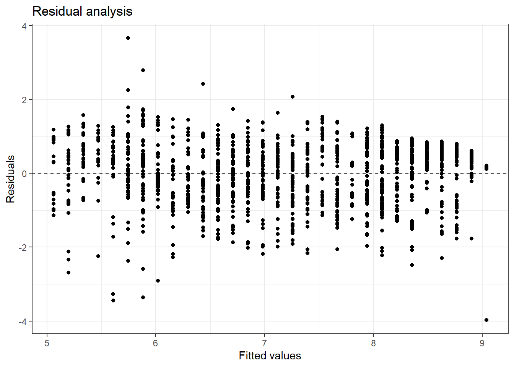
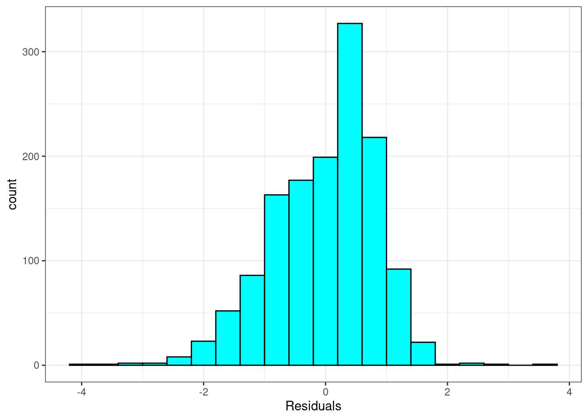

# (PART) Predictive Statistical Modeling {-} 

# Case Study {#CS4}

## Objectives

1) Using `R`, generate a linear regression model and use it to produce a prediction model.  
2) Using plots, check the assumptions of a linear regression model.  

## Homework  

### Problem 1

**HFI**   

Choose another freedom variable and a variable you think would strongly correlate with it. Note: even though some of the variables will appear to be quantitative, they don't take on enough different values and thus appear to be categorical. So choose with some caution. The `openintro` package contains the data set `hfi`. Type `?openintro::hfi` in the Console window in `RStudio` to learn more about the variables. 
    


```r
hfi<-read_csv("data/hfi.csv")
```
    
a. Produce a scatterplot of the two variables.  

We selected `pf_expression_influence` as it is a measure of laws and regulations that influence media content. We kept `pf_score` because it is a measure of personal freedom in a country. Our thought is these should be correlated.


```r
gf_lm(pf_score~pf_expression_influence,data=hfi,color="black") %>%
  gf_theme(theme_bw()) %>%
  gf_point(alpha=0.3) %>%
  gf_labs(title="Personal freedom score versus Control on media",
          x="Laws and regulations that influence media content",
          y="Personal freedom score")
```




b. Quantify the strength of the relationship with the correlation coefficient.


```r
hfi %>%
  summarise(cor(pf_expression_influence, pf_score, use = "complete.obs"))
```

```
## # A tibble: 1 × 1
##   `cor(pf_expression_influence, pf_score, use = "complete.obs")`
##                                                            <dbl>
## 1                                                          0.787
```

c. Fit a linear model. At a glance, does there seem to be a linear relationship?


```r
m2 <- lm(pf_score ~ pf_expression_influence, data = hfi)
```


```r
summary(m2)
```

```
## 
## Call:
## lm(formula = pf_score ~ pf_expression_influence, data = hfi)
## 
## Residuals:
##     Min      1Q  Median      3Q     Max 
## -3.9688 -0.5830  0.1681  0.5903  3.6730 
## 
## Coefficients:
##                         Estimate Std. Error t value Pr(>|t|)    
## (Intercept)              5.06135    0.05064   99.95   <2e-16 ***
## pf_expression_influence  0.41150    0.00869   47.36   <2e-16 ***
## ---
## Signif. codes:  0 '***' 0.001 '**' 0.01 '*' 0.05 '.' 0.1 ' ' 1
## 
## Residual standard error: 0.8482 on 1376 degrees of freedom
##   (80 observations deleted due to missingness)
## Multiple R-squared:  0.6197,	Adjusted R-squared:  0.6195 
## F-statistic:  2243 on 1 and 1376 DF,  p-value: < 2.2e-16
```


d. How does this relationship compare to the relationship between 
    `pf_expression_control` and `pf_score`? Use the $R^2$ values from the two 
    model summaries to compare. Does your independent variable seem to predict
    your dependent one better? Why or why not?
    
    The adjusted $R^2$ is a little smaller so the fit is not as good.
    
e. Display the model diagnostics for the regression model analyzing this relationship.


**Linearity**: 


```r
ggplot(data = m2, aes(x = .fitted, y = .resid)) +
  geom_point() +
  geom_hline(yintercept = 0, linetype = "dashed") +
  labs(x="Fitted values",y="Residuals",title="Residual analysis") +
  theme_bw()
```

<div class="figure">

<p class="caption">(\#fig:residuals)Fitted values versus residuals for diagnostics.</p>
</div>

There does appear to be some type of fluctuation so the linear model may not be appropriate. 

**Nearly normal residuals**: 


```r
ggplot(data = m2, aes(x = .resid)) +
  geom_histogram(binwidth = .4,fill="cyan",color="black") +
  xlab("Residuals") +
  theme_bw()
```



or a normal probability plot of the residuals.


```r
ggplot(data = m2, aes(sample = .resid)) +
  stat_qq() +
  theme_bw() +
  geom_abline(slope=1,intercept = 0)
```


No, the sample is small but it appears the residual are skewed to the left.

**Constant variability**:

Based on Figure \@ref(fig:residuals), the width of the plot seems constant with the exception of some extreme points. The constant variability assumption seems reasonable.  

f. Predict the response from your explanatory variable for a value between the median and third quartile. Is this an overestimate or an underestimate, and by how much? 


```r
summary(hfi$pf_expression_influence)
```

```
##    Min. 1st Qu.  Median    Mean 3rd Qu.    Max.    NA's 
##   0.000   3.000   5.333   5.200   7.333   9.667      80
```


```r
predict(m2,newdata=data.frame(pf_expression_influence=6))
```

```
##       1 
## 7.53036
```

We thus predict a value of 7.53 for the `pf_score`.

The observed value is 7.96, an average of 42 data points. We tend to underestimate the observed value.


```r
library(broom)
```


```r
augment(m2) %>%
   filter(pf_expression_influence==6) %>%
    summarize(ave=mean(pf_score),n=n())
```

```
## # A tibble: 1 × 2
##     ave     n
##   <dbl> <int>
## 1  7.96    42
```
