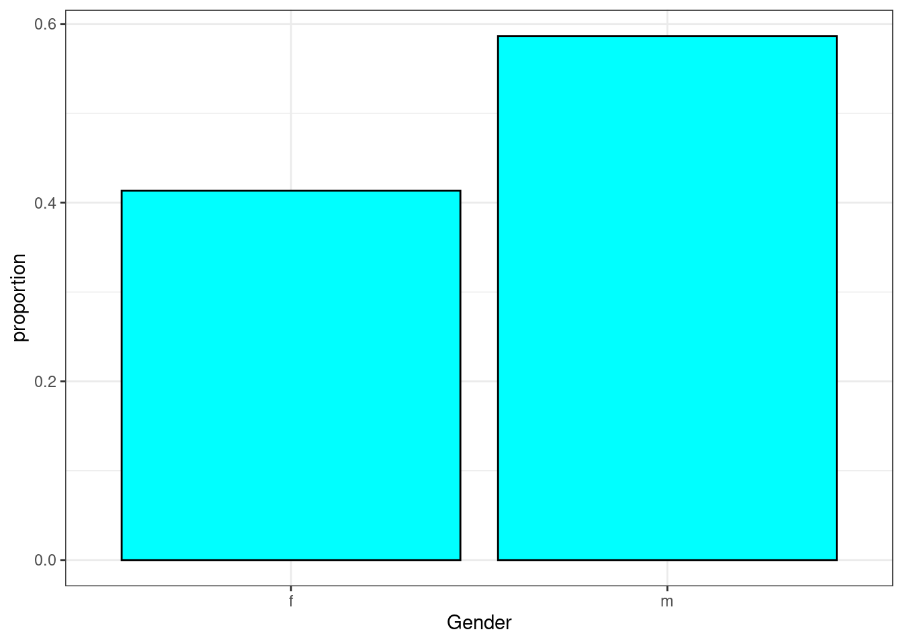
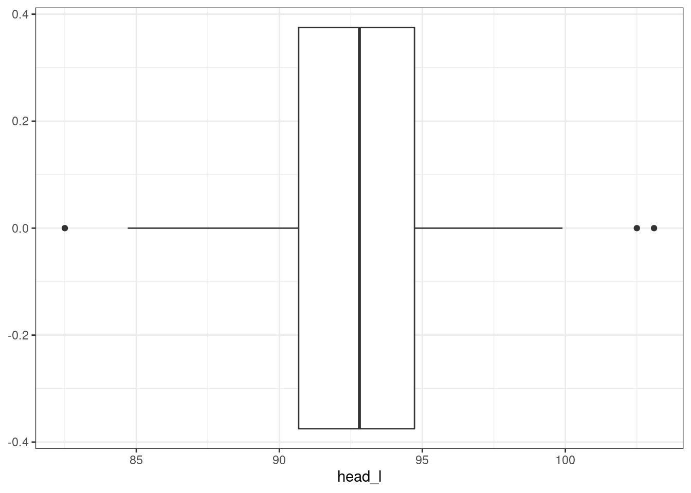
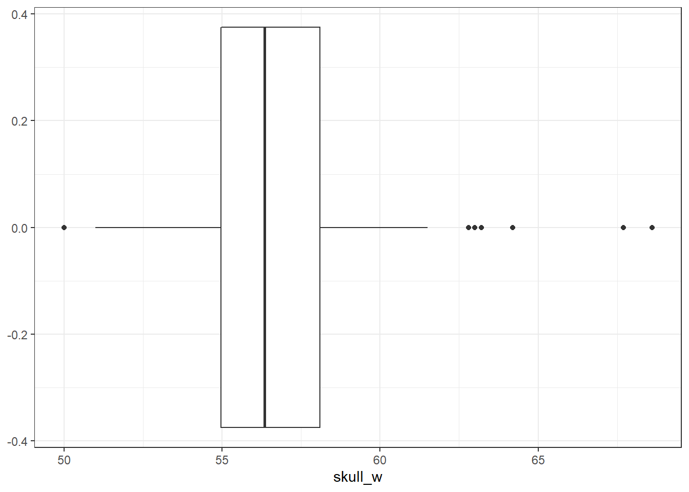
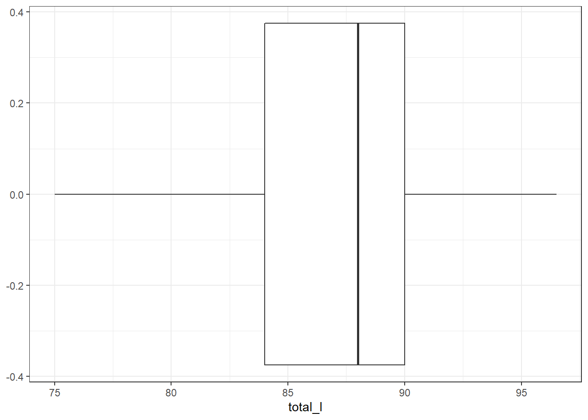
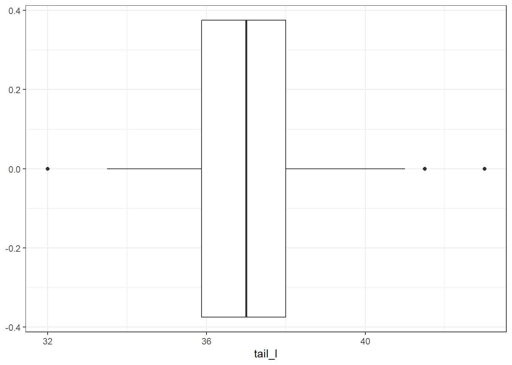
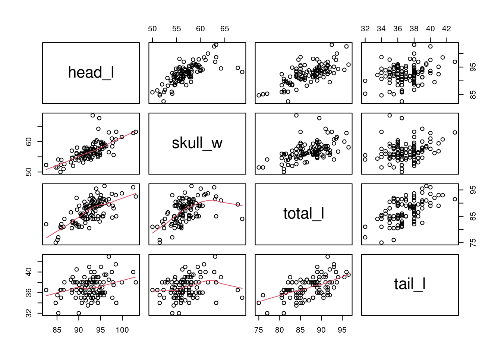
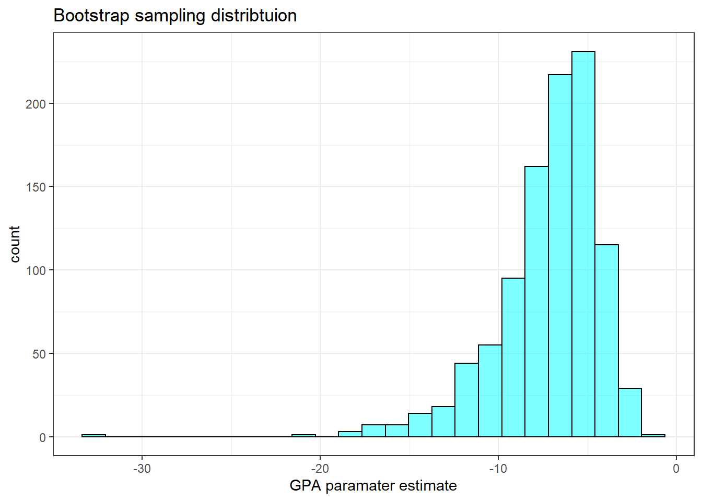

# Logistic Regression {#LOGREG}

## Objectives

1) Using `R`, conduct logistic regression and interpret the output and perform model selection.  
2) Write the logistic regression model and predict outputs for given inputs.  
3) Find confidence intervals for parameter estimates and predictions.    
4) Create and interpret a confusion matrix.    

## Homework Problems

### Problem 1

**Possum classification** 

Let's investigate the `possum` data set again. This time we want to model a binary outcome variable. As a reminder, the common brushtail possum of the Australia region is a bit cuter than its distant cousin, the American opossum. We consider 104 brushtail possums from two regions in Australia, where the possums may be considered a random sample from the population. The first region is Victoria, which is in the eastern half of Australia and traverses the southern coast. The second region consists of New South Wales and Queensland, which make up eastern and northeastern Australia.

We use logistic regression to differentiate between possums in these two regions. The outcome variable, called `pop`, takes value `Vic` when a possum is from Victoria and `other` when it is from New South Wales or Queensland. We consider five predictors: `sex`, `head_l`, `skull_w`, `total_l`, and `tail_l`. 

a. Explore the data by making histograms of the quantitative variables, and bar charts of the discrete variables.  Are there any outliers that are likely to have a very large influence on the logistic regression model?  


```r
possum <- read_csv("data/possum.csv") %>%
  select(pop,sex,head_l,skull_w,total_l,tail_l) %>%
  mutate(pop=factor(pop),sex=factor(sex))
```


```r
inspect(possum)
```

```
## 
## categorical variables:  
##   name  class levels   n missing                                  distribution
## 1  pop factor      2 104       0 other (55.8%), Vic (44.2%)                   
## 2  sex factor      2 104       0 m (58.7%), f (41.3%)                         
## 
## quantitative variables:  
##         name   class  min     Q1 median     Q3   max     mean       sd   n
## ...1  head_l numeric 82.5 90.675  92.80 94.725 103.1 92.60288 3.573349 104
## ...2 skull_w numeric 50.0 54.975  56.35 58.100  68.6 56.88365 3.113426 104
## ...3 total_l numeric 75.0 84.000  88.00 90.000  96.5 87.08846 4.310549 104
## ...4  tail_l numeric 32.0 35.875  37.00 38.000  43.0 37.00962 1.959518 104
##      missing
## ...1       0
## ...2       0
## ...3       0
## ...4       0
```


```r
possum %>%
  gf_props(~pop,fill="cyan",color="black") %>%
  gf_theme(theme_bw()) %>%
  gf_labs(x="Population")
```


```r
possum %>%
  gf_props(~sex,fill="cyan",color="black") %>%
  gf_theme(theme_bw()) %>%
  gf_labs(x="Gender")
```



```r
possum %>%
  gf_boxplot(~head_l) %>%
  gf_theme(theme_bw())
```




```r
possum %>%
  gf_boxplot(~skull_w) %>%
  gf_theme(theme_bw())
```




```r
possum %>%
  gf_boxplot(~total_l) %>%
  gf_theme(theme_bw())
```




```r
possum %>%
  gf_boxplot(~tail_l) %>%
  gf_theme(theme_bw())
```



There are some potential outliers for skull width but otherwise not much concern.


```r
pairs(possum[,3:6],lower.panel = panel.smooth)
```


We can see that `head_l` is correlated with the other three variables. This will cause some multicollinearity problems.

b. Build a logistic regression model with all the variable.  Report a summary of the model. 


```r
possum_mod <- glm(pop=="Vic"~.,data=possum,family="binomial")
```


```r
summary(possum_mod)
```

```
## 
## Call:
## glm(formula = pop == "Vic" ~ ., family = "binomial", data = possum)
## 
## Deviance Residuals: 
##     Min       1Q   Median       3Q      Max  
## -1.6430  -0.5514  -0.1182   0.3760   2.8501  
## 
## Coefficients:
##             Estimate Std. Error z value Pr(>|z|)    
## (Intercept)  39.2349    11.5368   3.401 0.000672 ***
## sexm         -1.2376     0.6662  -1.858 0.063195 .  
## head_l       -0.1601     0.1386  -1.155 0.248002    
## skull_w      -0.2012     0.1327  -1.517 0.129380    
## total_l       0.6488     0.1531   4.236 2.27e-05 ***
## tail_l       -1.8708     0.3741  -5.001 5.71e-07 ***
## ---
## Signif. codes:  0 '***' 0.001 '**' 0.01 '*' 0.05 '.' 0.1 ' ' 1
## 
## (Dispersion parameter for binomial family taken to be 1)
## 
##     Null deviance: 142.787  on 103  degrees of freedom
## Residual deviance:  72.155  on  98  degrees of freedom
## AIC: 84.155
## 
## Number of Fisher Scoring iterations: 6
```


```r
confint(possum_mod)
```

```
## Waiting for profiling to be done...
```

```
##                  2.5 %      97.5 %
## (Intercept) 18.8530781 64.66444839
## sexm        -2.6227018  0.02472167
## head_l      -0.4428559  0.10865739
## skull_w     -0.4933140  0.04479826
## total_l      0.3768179  0.98455786
## tail_l      -2.7170468 -1.23231969
```


c. Using the p-values decide if you want to remove a variable(S) and if so build that model. 

Let's remove `head_l` first.


```r
possum_mod_red <- glm(pop=="Vic"~sex+skull_w+total_l+tail_l,data=possum,family="binomial")
```


```r
summary(possum_mod_red)
```

```
## 
## Call:
## glm(formula = pop == "Vic" ~ sex + skull_w + total_l + tail_l, 
##     family = "binomial", data = possum)
## 
## Deviance Residuals: 
##     Min       1Q   Median       3Q      Max  
## -1.8102  -0.5683  -0.1222   0.4153   2.7599  
## 
## Coefficients:
##             Estimate Std. Error z value Pr(>|z|)    
## (Intercept)  33.5095     9.9053   3.383 0.000717 ***
## sexm         -1.4207     0.6457  -2.200 0.027790 *  
## skull_w      -0.2787     0.1226  -2.273 0.023053 *  
## total_l       0.5687     0.1322   4.302 1.69e-05 ***
## tail_l       -1.8057     0.3599  -5.016 5.26e-07 ***
## ---
## Signif. codes:  0 '***' 0.001 '**' 0.01 '*' 0.05 '.' 0.1 ' ' 1
## 
## (Dispersion parameter for binomial family taken to be 1)
## 
##     Null deviance: 142.787  on 103  degrees of freedom
## Residual deviance:  73.516  on  99  degrees of freedom
## AIC: 83.516
## 
## Number of Fisher Scoring iterations: 6
```

Since `head_l` was correlated with the other variables, removing it has increased the precision, decreased the standard error, of the other predictors. There p-values are all now less than 0.05. 

d. For any variable you decide to remove, build a 95% confidence interval for the parameter.


```r
confint(possum_mod)
```

```
## Waiting for profiling to be done...
```

```
##                  2.5 %      97.5 %
## (Intercept) 18.8530781 64.66444839
## sexm        -2.6227018  0.02472167
## head_l      -0.4428559  0.10865739
## skull_w     -0.4933140  0.04479826
## total_l      0.3768179  0.98455786
## tail_l      -2.7170468 -1.23231969
```

We are 95\% confident that the true slope coefficient for `head_l` is between -0.44 and 0.108.

The bootstrap is not working for this problem. It may be that we have convergence issues when we resample the data. This is a reminder that we need to be careful and not just run methods without checking results. Here is the code:


```r
set.seed(952)
results<-do(1000)*glm(pop=="Vic"~.,data=resample(possum),family="binomial")
```


```r
head(results[,1:5])
```

```
##     Intercept          sexm        head_l       skull_w       total_l
## 1 -1184.61865  2.122389e+01  3.861560e+00  2.749263e+00  7.274005e+00
## 2  6371.55494 -1.301513e+02  1.023732e+01 -2.738815e+01 -1.076913e+01
## 3 -9612.61859 -2.392899e+03 -1.875252e+02  5.782026e+02 -2.820691e+02
## 4   -25.18662 -1.852185e+01  2.097593e+01 -1.353619e+01  1.483815e+01
## 5   -26.56607  2.167890e-13 -4.396307e-15  5.075768e-15  4.484497e-14
## 6 -1025.00035  6.159665e+01  2.526181e+01 -2.032143e+01  1.438639e+01
```


```r
results %>%
  gf_histogram(~head_l,fill="cyan",color = "black") %>%
  gf_theme(theme_bw()) %>%
  gf_labs(title="Bootstrap sampling distribtuion",
          x="sex paramater estimate")
```


```r
cdata(~head_l,data=results)
```

```
##          lower    upper central.p
## 2.5% -187.5252 63.61867      0.95
```

This interval is too large. The resampling process has too much variation in it. This could be due to the small sample size and the multicollinearity.

e. Explain why the remaining parameter estimates change between the two models. 

When coefficient estimates are sensitive to which variables are included in the model, this typically indicates that some variables are collinear. For example, a possum's gender may be related to its head length, which would explain why the coefficient (and p-value) for sex male changed when we removed the head length variable. Likewise, a possum's skull width is likely to be related to its head length, probably even much more closely related than the head length was to gender.


f. Write out the form of the model. Also identify which of the following variables are positively associated (when controlling for other variables) with a possum being from Victoria: `head_l`, `skull_w`, `total_l`, and `tail_l`.  

We dropped `head_l` from the model. Here is the equation:

$$
\log_{e}\left( \frac{p_i}{1-p_i} \right)
	= 33.5 - 1.42 \text{ sex} -0.28 \text{ skull width}  + 0.57 \text{ total length} - 1.81 \text{ tail length}
$$  

Only `total_l` is positively association with the probability of being from Victoria. 

g. Suppose we see a brushtail possum at a zoo in the US, and a sign says the possum had been captured in the wild in Australia, but it doesn't say which part of Australia. However, the sign does indicate that the possum is male, its skull is about 63 mm wide, its tail is 37 cm long, and its total length is 83 cm. What is the reduced model's computed probability that this possum is from Victoria? How confident are you in the model's accuracy of this probability calculation?

Let's predict the outcome. We use `response` for the type to put the answer in the form of a probability. See the help menu on `predict.glm` for more information.  


```r
predict(possum_mod_red,newdata = data.frame(sex="m",skull_w=63,tail_l=37,total_l=83),
        type="response",se.fit = TRUE)
```

```
## $fit
##           1 
## 0.006205055 
## 
## $se.fit
##           1 
## 0.008011468 
## 
## $residual.scale
## [1] 1
```


While the probability, 0.006, is very near zero, we have not run diagnostics on the model. We should also have a little skepticism that the model will hold for a possum found in a US zoo. However, it is encouraging that the possum was caught in the wild.

As a rough sense of the accuracy, we will use the standard error. The errors are really binomial but we are trying to use a normal approximation. If you remember back to our block on probability, with such a low probability, this assumption of normality is suspect. However, we will use it to give us an upper bound.


```r
0.0062+c(-1,1)*1.96*.008
```

```
## [1] -0.00948  0.02188
```

So at most, the probability of the possum being from Victoria is 2\%.

### Problem 2

**Medical school admission**

The file `MedGPA.csv` in the `data` folder has information on medical school admission status and GPA and standardized test scores gathered on 55 medical school applicants from a liberal arts college in the Midwest.

The variables are:

`Accept Status`: A=accepted to medical school or D=denied admission
`Acceptance`:	Indicator for Accept: 1=accepted or 0=denied  
`Sex`: F=female or M=male  
`BCPM`:	Bio/Chem/Physics/Math grade point average  
`GPA`:	College grade point average  
`VR`:	Verbal reasoning (subscore)  
`PS`:	Physical sciences (subscore)  
`WS`:	Writing sample (subcore)  
`BS`:	Biological sciences (subscore)  
`MCAT`:	Score on the MCAT exam (sum of CR+PS+WS+BS)  
`Apps`:	Number of medical schools applied to  

a. Build a logistic regression model to predict `Acceptance` from `GPA` and `Sex.  


```r
MedGPA <- read_csv("data/MedGPA.csv")
```


```r
glimpse(MedGPA)
```

```
## Rows: 55
## Columns: 11
## $ Accept     <chr> "D", "A", "A", "A", "A", "A", "A", "D", "A", "A", "A", "A",~
## $ Acceptance <dbl> 0, 1, 1, 1, 1, 1, 1, 0, 1, 1, 1, 1, 1, 0, 0, 1, 0, 1, 0, 1,~
## $ Sex        <chr> "F", "M", "F", "F", "F", "M", "M", "M", "F", "F", "F", "F",~
## $ BCPM       <dbl> 3.59, 3.75, 3.24, 3.74, 3.53, 3.59, 3.85, 3.26, 3.74, 3.86,~
## $ GPA        <dbl> 3.62, 3.84, 3.23, 3.69, 3.38, 3.72, 3.89, 3.34, 3.71, 3.89,~
## $ VR         <dbl> 11, 12, 9, 12, 9, 10, 11, 11, 8, 9, 11, 11, 8, 9, 11, 12, 8~
## $ PS         <dbl> 9, 13, 10, 11, 11, 9, 12, 11, 10, 9, 9, 8, 10, 9, 8, 8, 8, ~
## $ WS         <dbl> 9, 8, 5, 7, 4, 7, 6, 8, 6, 6, 8, 4, 7, 4, 6, 8, 8, 9, 5, 8,~
## $ BS         <dbl> 9, 12, 9, 10, 11, 10, 11, 9, 11, 10, 11, 8, 10, 10, 7, 10, ~
## $ MCAT       <dbl> 38, 45, 33, 40, 35, 36, 40, 39, 35, 34, 39, 31, 35, 32, 32,~
## $ Apps       <dbl> 5, 3, 19, 5, 11, 5, 5, 7, 5, 11, 6, 9, 5, 8, 15, 6, 6, 1, 5~
```


```r
med_mod<-glm(Accept=="D"~GPA+Sex,data=MedGPA,family=binomial)
```


```r
summary(med_mod)
```

```
## 
## Call:
## glm(formula = Accept == "D" ~ GPA + Sex, family = binomial, data = MedGPA)
## 
## Deviance Residuals: 
##     Min       1Q   Median       3Q      Max  
## -2.4623  -0.7194  -0.2978   0.9753   1.8171  
## 
## Coefficients:
##             Estimate Std. Error z value Pr(>|z|)    
## (Intercept)  21.0680     6.4025   3.291 0.001000 ***
## GPA          -6.1324     1.8283  -3.354 0.000796 ***
## SexM          1.1697     0.7178   1.629 0.103210    
## ---
## Signif. codes:  0 '***' 0.001 '**' 0.01 '*' 0.05 '.' 0.1 ' ' 1
## 
## (Dispersion parameter for binomial family taken to be 1)
## 
##     Null deviance: 75.791  on 54  degrees of freedom
## Residual deviance: 53.945  on 52  degrees of freedom
## AIC: 59.945
## 
## Number of Fisher Scoring iterations: 5
```

b. Generate a 95% confidence interval for the coefficient associated with `GPA`. 


```r
confint(med_mod)
```

```
## Waiting for profiling to be done...
```

```
##                   2.5 %    97.5 %
## (Intercept)  10.0651173 35.579760
## GPA         -10.2977983 -3.007544
## SexM         -0.1720454  2.697436
```

Let's try the bootstrap for this problem.


```r
set.seed(819)
results_med <- do(1000)*glm(Accept=="D"~GPA+Sex,data=resample(MedGPA),family=binomial)
```

```
## Warning: glm.fit: fitted probabilities numerically 0 or 1 occurred
```


```r
results_med %>%
  gf_histogram(~GPA,fill="cyan",color = "black") %>%
  gf_theme(theme_bw()) %>%
  gf_labs(title="Bootstrap sampling distribtuion",
          x="GPA paramater estimate")
```




```r
cdata(~GPA,data=results_med)
```

```
##         lower     upper central.p
## 2.5% -14.2047 -3.213036      0.95
```

This is not so bad. It appears that the distribution of `GPA` is skewed to the left.  

c. Fit a model with a polynomial of degree 2 in the `GPA`. Drop `Sex` from the model. Does a quadratic fit improve the model? 


```r
med_mod2<-glm(Accept=="D"~poly(GPA,2),data=MedGPA,family=binomial)
```


```r
summary(med_mod2)
```

```
## 
## Call:
## glm(formula = Accept == "D" ~ poly(GPA, 2), family = binomial, 
##     data = MedGPA)
## 
## Deviance Residuals: 
##     Min       1Q   Median       3Q      Max  
## -1.9553  -0.7830  -0.3207   0.8020   1.8363  
## 
## Coefficients:
##               Estimate Std. Error z value Pr(>|z|)    
## (Intercept)    -0.3301     0.3582  -0.921 0.356822    
## poly(GPA, 2)1 -10.7293     3.0664  -3.499 0.000467 ***
## poly(GPA, 2)2  -3.4967     3.0987  -1.128 0.259133    
## ---
## Signif. codes:  0 '***' 0.001 '**' 0.01 '*' 0.05 '.' 0.1 ' ' 1
## 
## (Dispersion parameter for binomial family taken to be 1)
## 
##     Null deviance: 75.791  on 54  degrees of freedom
## Residual deviance: 55.800  on 52  degrees of freedom
## AIC: 61.8
## 
## Number of Fisher Scoring iterations: 4
```
The quadratic term did not improve the model. 

d. Fit a model with just `GPA` and interpret the coefficient. 

```r
tidy(glm(Accept=="D"~GPA,data=MedGPA,family=binomial))
```

```
## # A tibble: 2 x 5
##   term        estimate std.error statistic  p.value
##   <chr>          <dbl>     <dbl>     <dbl>    <dbl>
## 1 (Intercept)    19.2       5.63      3.41 0.000644
## 2 GPA            -5.45      1.58     -3.45 0.000553
```


```r
exp(-5.454166)
```

```
## [1] 0.004278444
```

An increase of 1 in a student's GPA decreases the odds of being denied acceptance by 0.00428. Remember that this is not a probability. As a reminder an odds of $\frac{1}{2}$ means the probability of success is $\frac{1}{3}$. An odds of 1 means a probability of success of $\frac{1}{2}$. Assume the initial odds are 1 if the odds are now 0.00428 smaller, then the probability of success is $\frac{428}{10428}$ or 0.04. The probability decreased by an order of magnitude.

e. Try to add different predictors to come up with your best model. Do not use Acceptance and MCAT in the model.


```r
tidy(glm(Accept=="D"~.-Acceptance-MCAT,data=MedGPA,family=binomial)) %>%
  mutate(p.adj=p.adjust(p.value)) %>%
  select(term,p.value,p.adj)
```

```
## # A tibble: 9 x 3
##   term        p.value  p.adj
##   <chr>         <dbl>  <dbl>
## 1 (Intercept) 0.00279 0.0251
## 2 SexM        0.110   0.551 
## 3 BCPM        0.376   1     
## 4 GPA         0.150   0.600 
## 5 VR          0.799   1     
## 6 PS          0.0305  0.213 
## 7 WS          0.0491  0.295 
## 8 BS          0.00490 0.0392
## 9 Apps        0.728   1
```

Let's take out `VR`.


```r
tidy(glm(Accept=="D"~.-Acceptance-MCAT-VR,data=MedGPA,family=binomial)) %>%
  mutate(p.adj=p.adjust(p.value)) %>%
  select(term,p.value,p.adj)
```

```
## # A tibble: 8 x 3
##   term        p.value  p.adj
##   <chr>         <dbl>  <dbl>
## 1 (Intercept) 0.00239 0.0191
## 2 SexM        0.0681  0.272 
## 3 BCPM        0.362   0.723 
## 4 GPA         0.143   0.430 
## 5 PS          0.0280  0.168 
## 6 WS          0.0452  0.226 
## 7 BS          0.00476 0.0333
## 8 Apps        0.742   0.742
```
Now let's take out `Apps`.


```r
tidy(glm(Accept=="D"~.-Acceptance-MCAT-VR-Apps,data=MedGPA,family=binomial)) %>%
  mutate(p.adj=p.adjust(p.value)) %>%
  select(term,p.value,p.adj)
```

```
## # A tibble: 7 x 3
##   term        p.value  p.adj
##   <chr>         <dbl>  <dbl>
## 1 (Intercept) 0.00147 0.0103
## 2 SexM        0.0272  0.133 
## 3 BCPM        0.379   0.379 
## 4 GPA         0.120   0.240 
## 5 PS          0.0266  0.133 
## 6 WS          0.0385  0.133 
## 7 BS          0.00477 0.0286
```

Next, let's remove `BCPM`.


```r
tidy(glm(Accept=="D"~.-Acceptance-MCAT-VR-Apps-BCPM,
         data=MedGPA,family=binomial)) %>%
  mutate(p.adj=p.adjust(p.value)) %>%
  select(term,p.value,p.adj)
```

```
## # A tibble: 6 x 3
##   term        p.value   p.adj
##   <chr>         <dbl>   <dbl>
## 1 (Intercept) 0.00123 0.00739
## 2 SexM        0.0142  0.0567 
## 3 GPA         0.0315  0.0901 
## 4 PS          0.0300  0.0901 
## 5 WS          0.0401  0.0901 
## 6 BS          0.00537 0.0269
```

Now `WS`.


```r
tidy(glm(Accept=="D"~.-Acceptance-MCAT-VR-Apps-BCPM-WS,
         data=MedGPA,family=binomial)) %>%
  mutate(p.adj=p.adjust(p.value)) %>%
  select(term,p.value,p.adj)
```

```
## # A tibble: 5 x 3
##   term         p.value   p.adj
##   <chr>          <dbl>   <dbl>
## 1 (Intercept) 0.000584 0.00292
## 2 SexM        0.0168   0.0504 
## 3 GPA         0.0366   0.0732 
## 4 PS          0.0634   0.0732 
## 5 BS          0.0100   0.0401
```

Maybe `PS`.


```r
tidy(glm(Accept=="D"~.-Acceptance-MCAT-VR-Apps-BCPM-WS-PS,
         data=MedGPA,family=binomial)) %>%
  mutate(p.adj=p.adjust(p.value)) %>%
  select(term,p.value,p.adj)
```

```
## # A tibble: 4 x 3
##   term         p.value   p.adj
##   <chr>          <dbl>   <dbl>
## 1 (Intercept) 0.000574 0.00230
## 2 SexM        0.0306   0.0611 
## 3 GPA         0.0325   0.0611 
## 4 BS          0.00448  0.0134
```

We will stop there. There has to be a better way. Machine learning and advanced regression courses explore how to select predictors and improve a model. 

f. Generate a confusion matrix for the best model you have developed.  


```r
med_mod2<-glm(Accept=="D"~Sex+GPA+BS,
         data=MedGPA,family=binomial)
```


```r
summary(med_mod2)
```

```
## 
## Call:
## glm(formula = Accept == "D" ~ Sex + GPA + BS, family = binomial, 
##     data = MedGPA)
## 
## Deviance Residuals: 
##     Min       1Q   Median       3Q      Max  
## -1.8388  -0.4707  -0.1347   0.5535   2.6411  
## 
## Coefficients:
##             Estimate Std. Error z value Pr(>|z|)    
## (Intercept)  27.4608     7.9721   3.445 0.000572 ***
## SexM          1.9885     0.9193   2.163 0.030543 *  
## GPA          -4.2900     2.0062  -2.138 0.032484 *  
## BS           -1.3752     0.4838  -2.843 0.004471 ** 
## ---
## Signif. codes:  0 '***' 0.001 '**' 0.01 '*' 0.05 '.' 0.1 ' ' 1
## 
## (Dispersion parameter for binomial family taken to be 1)
## 
##     Null deviance: 75.791  on 54  degrees of freedom
## Residual deviance: 40.835  on 51  degrees of freedom
## AIC: 48.835
## 
## Number of Fisher Scoring iterations: 6
```


```r
augment(med_mod2,type.predict = "response") %>%
  rename(actual=starts_with('Accept ==')) %>%
  transmute(result=as.integer(.fitted>0.5),
            actual=as.integer(actual)) %>%
  table()
```

```
##       actual
## result  0  1
##      0 26  4
##      1  4 21
```

This model has an accuracy of $\frac{47}{55}$ or 85.5%.


f. Find a 95% confidence interval for the probability a female student with a 3.5 GPA, a `BCPM` of 3.8, a verbal reasoning score of 10, a physical sciences score of 9, a writing sample score of 8, a biological score of 10, a MCAT score of 40, and who applied to 5 medical schools.  


```r
predict(med_mod2,newdata = data.frame(Sex="F",
                                      GPA=3.5,
                                      BS=10),
        type="response",se.fit = TRUE)
```

```
## $fit
##         1 
## 0.2130332 
## 
## $se.fit
##         1 
## 0.1122277 
## 
## $residual.scale
## [1] 1
```


```r
0.2130332+c(-1,1)*1.96*.1122277
```

```
## [1] -0.006933092  0.432999492
```

For a female students with a GPA of 3.5 and a biological score of 10, we are 95% confident that the probability of being denied acceptance to medical school is between 0 and .433.  

Let's try a bootstrap.


```r
set.seed(729)
results <- do(1000)*glm(Accept=="D"~Sex+GPA+BS,
                      data=resample(MedGPA),
                      family=binomial)
```


```r
head(results)
```

```
##    Intercept       SexM        GPA         BS .row .index
## 1  204.23984  20.701630  -4.547781 -20.801516    1      1
## 2   16.78193   1.373795  -2.508340  -0.908112    1      2
## 3   36.09536   4.170571  -7.479463  -1.219088    1      3
## 4 1104.42269 105.236280 -90.461857 -86.132398    1      4
## 5   25.37989   1.139262  -3.729948  -1.331750    1      5
## 6   26.58307   3.197072  -3.426165  -1.772581    1      6
```


```r
results_pred <- results %>% 
  mutate(pred=1/(1+exp(-1*(Intercept+3.5*GPA+10*BS))))
```


```r
cdata(~pred,data=results_pred)
```

```
##            lower     upper central.p
## 2.5% 7.77316e-10 0.5032905      0.95
```

This is close to what we found and does not make the assumption the probability of success is normally distributed. 
